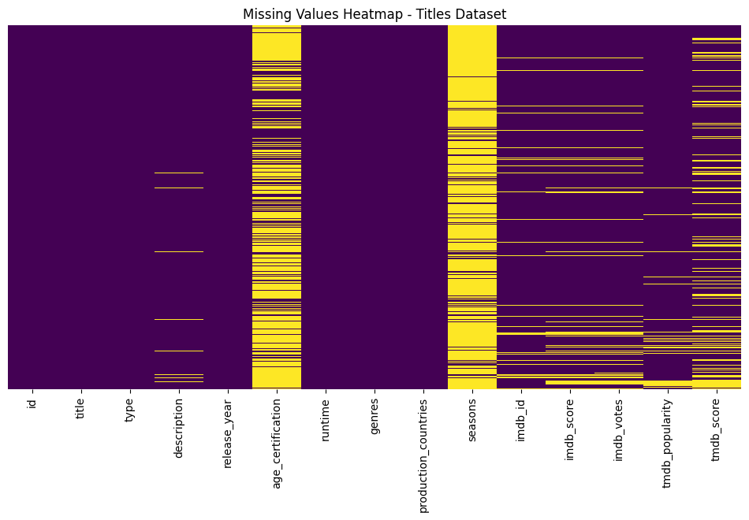
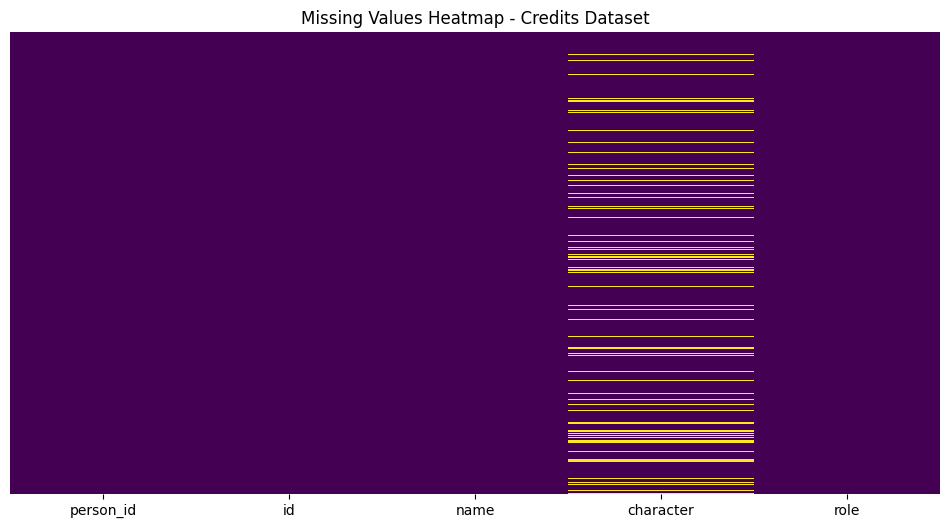
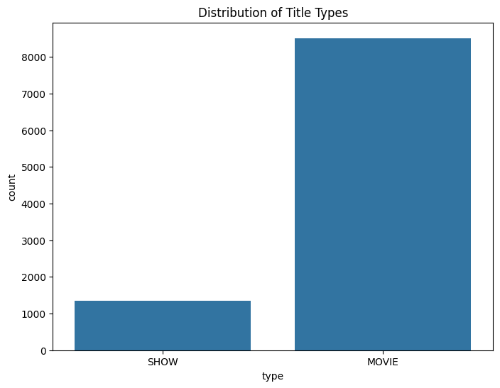
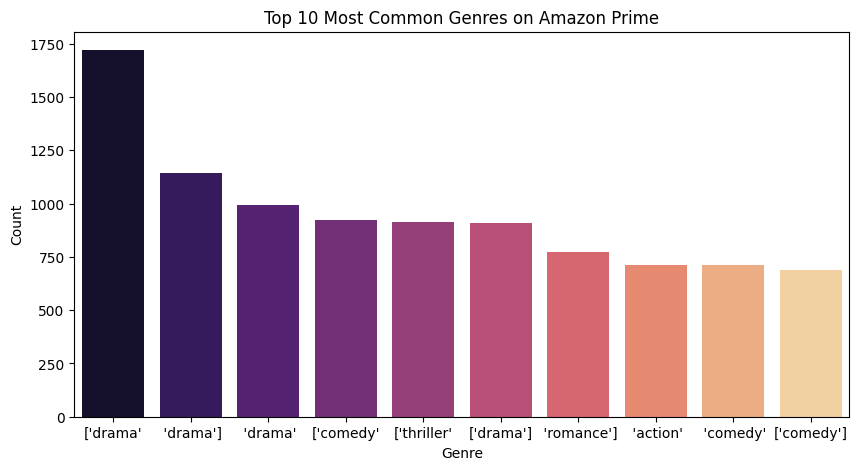

# almabetter
Almabetter Project Repository
# Amazon Prime TV Shows and Movies - Exploratory Data Analysis (EDA)

## 📌 Project Overview
This project focuses on analyzing **Amazon Prime TV Shows and Movies** using **Exploratory Data Analysis (EDA)** techniques. The goal is to uncover insights related to content availability, genres, ratings, trends, and distribution patterns on the platform.

## 🛠️ Tools & Technologies Used
- **Python**: Data manipulation and visualization
- **Pandas**: Data cleaning and transformation
- **NumPy**: Numerical analysis
- **Matplotlib & Seaborn**: Data visualization
- **Plotly**: Interactive charts
- **Google Collab**: Running and documenting the analysis

**Code:**
# Import Libraries
import pandas as pd
import numpy as np
import seaborn as sns
import matplotlib.pyplot as plt
from google.colab import drive
drive.mount('/content/drive')

## 📊 Dataset Information
The dataset consists of Amazon Prime's movie and TV show listings, containing the following key attributes:
- **Title**: Name of the show or movie.
- **Type**: Whether it's a movie or TV show.
- **Genre**: Categories such as Drama, Action, Documentary, etc.
- **Release Year**: Year of release.
- **IMDb Rating**: IMDb score for each title.
- **Duration**: Length of the content (in minutes or seasons).
- **Country**: Country of origin.
- **Director & Cast**: Details of the creators and actors.

**Code**
#Dataset Upload
titles = '/content/drive/MyDrive/titles.csv'
credits = '/content/drive/MyDrive/credits.csv'
print("Upload credits.csv and titles.csv")

# ✅ Step 3: Load Datasets
df_titles = pd.read_csv(titles)
df_credits = pd.read_csv(credits)

## 🔍 Key Steps in EDA
1. **Data Cleaning**
   - Handling missing values
   - Standardizing text formats
   - Removing duplicate entries

2. **Exploratory Data Analysis**
   - Distribution of movies vs. TV shows
   - Most popular genres
   - Trends in content release over the years
   - IMDb rating distribution and top-rated content
   - Country-wise content availability

3. **Visualization Insights**
   - Bar charts for content count by genre
   - Line charts for content trends over time
   - Box plots for IMDb rating distributions
   - Word clouds for common movie titles

## 📌 Findings & Insights
- **Amazon Prime has a diverse collection** of content, with a focus on Drama and Action genres.
- **Most content was added in recent years**, indicating platform expansion.
- **IMDb ratings vary widely**, but a significant portion of content has ratings between 6 and 8.
- **Certain countries dominate content production**, with the USA leading the list.
**Code**
**# ✅ Step 4: Display First Few Rows**
print("\n🎬 Titles Dataset Preview:")
print(df_titles.head()) 
print("\n👤 Credits Dataset Preview:")
print(df_credits.head())

# duplicate value
print("/n🎬 Titles Dataset Duplicate Values:")
print(df_titles.duplicated().sum())
print("\n👤 Credits Dataset Duplicate Values:")
print(df_credits.duplicated().sum())
# Step5 .Missing Values/Null Values Count
print("\n🎬 Titles Dataset Missing Values:")
print(titles.isnull().sum())
print("\n👤 Credits Dataset Missing Values:")
print(credits.isnull().sum())
**Data Visualization**
# ✅ Step 6: Visualize Missing Data
plt.figure(figsize=(12, 6))
sns.heatmap(titles.isnull(), cmap="viridis", cbar=False, yticklabels=False)
plt.title("Missing Values Heatmap - Titles Dataset")
plt.show()

plt.figure(figsize=(12, 6))
sns.heatmap(credits.isnull(), cmap="viridis", cbar=False, yticklabels=False)
plt.title("Missing Values Heatmap - Credits Dataset")
plt.show()

# ✅ Step 7: Handle Missing Values
# Convert 'imdb_score' to numeric, handling errors
titles['imdb_score'] = pd.to_numeric(titles['imdb_score'], errors='coerce')
# Now fill NaN values with the median
titles['imdb_score'].fillna(titles['imdb_score'].median(), inplace=True)
titles.fillna("Unknown", inplace=True) # Fill other columns with 'Unknown' if needed
credits.fillna("Unknown", inplace=True)

# ✅ Step 9: Distribution of Title Types (TV Show / Movie)
plt.figure(figsize=(8, 6))
sns.countplot(x='type', data=titles)
plt.title('Distribution of Title Types')
plt.show()

# ✅ Step 10: Most Common Genres
genres = titles['genres'].str.split(',').explode().value_counts().head(10)
plt.figure(figsize=(10, 5))
sns.barplot(x=genres.index, y=genres.values, palette="magma")
plt.title("Top 10 Most Common Genres on Amazon Prime")
plt.xlabel("Genre")
plt.ylabel("Count")
plt.show()

# ✅ Step 11: IMDb Ratings Distribution
plt.figure(figsize=(8, 5))
sns.histplot(titles['imdb_score'].dropna(), bins=30, kde=True, color="blue")
plt.title("Distribution of IMDb Ratings")
plt.xlabel("IMDb Score")
plt.ylabel("Count")
plt.show()

# ✅ Step 12: Trends Over Time - Number of Titles Released Per Year
plt.figure(figsize=(12, 6))
sns.histplot(titles['release_year'], bins=30, kde=True, color="green")
plt.title("Trend of Content Releases Over Time")
plt.xlabel("Year")
plt.ylabel("Number of Titles")
plt.show()

# ✅ Step 13: IMDb Score vs. TMDb Score Correlation
numeric_cols = ["imdb_score", "tmdb_score"]
titles['imdb_score'] = pd.to_numeric(titles['imdb_score'], errors='coerce')
titles['tmdb_score'] = pd.to_numeric(titles['tmdb_score'], errors='coerce')
correlation_matrix = titles[numeric_cols].corr()

# Filter out rows with NaN values in numeric columns
filtered_titles = titles[numeric_cols].dropna()

plt.figure(figsize=(6, 4))
sns.heatmap(correlation_matrix, annot=True, cmap="coolwarm", linewidths=2)
plt.title("Correlation Matrix: IMDb vs. TMDb Scores")
plt.show()

# ✅ Step 14: Top 10 Highest-Rated Titles
top_rated = titles.sort_values(by="imdb_score", ascending=False).head(10)
print("\n🏆 Top 10 Highest-Rated Titles:")
print(top_rated[['title', 'imdb_score', 'type', 'genres']])

# ✅ Step 15: Popular Directors (Based on Number of Shows & Movies)
directors = credits[credits['role'] == 'DIRECTOR']['name'].value_counts().head(10)
plt.figure(figsize=(10, 5))
sns.barplot(x=directors.index, y=directors.values, palette="rocket")
plt.xticks(rotation=45)
plt.title("Top 10 Most Frequent Directors on Amazon Prime")
plt.xlabel("Director")
plt.ylabel("Number of Titles")
plt.show()

## 📈 Business Impact
Understanding content trends can help **Amazon Prime**:
- Improve content recommendations.
- Optimize licensing and production strategies.
- Enhance user engagement through data-driven insights.

## 🔗 How to Run the Notebook
1. Install required libraries: `pip install pandas numpy matplotlib seaborn plotly`
2. Load the dataset into a Pandas DataFrame.
3. Execute each cell in the Jupyter Notebook to generate visualizations.

## 📜 License
This project is for educational purposes only. The dataset belongs to its respective owners.

---
**Author**: Ankita  
📍 Hyderabad, India

